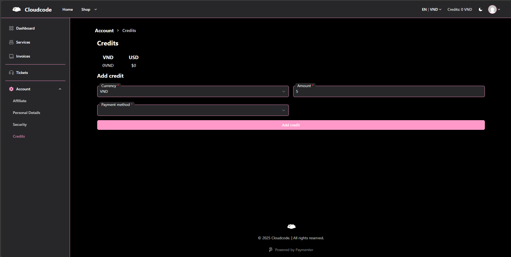

The Cloudcode billing system uses 2 currency: USD and VND. Which can be interchanged by pressing the dropdown box on the left of the "credits" text.

At Cloudcode, our user are freely between choosing how to pay as long they choose between top up credits or directly pay at the time of purchase

You can top up credits in Settings > Credits tab on the dashboard

__! Note: Minimum of 5k vnd for vnd top up and min $1 for USD top up__

Or you can pay for it while purchasing

Current payment methods are:
- VND: 
> QR Code transfer

- USD:
> Paypal  
> Card (Please open an ticket for payment info, topup only)
