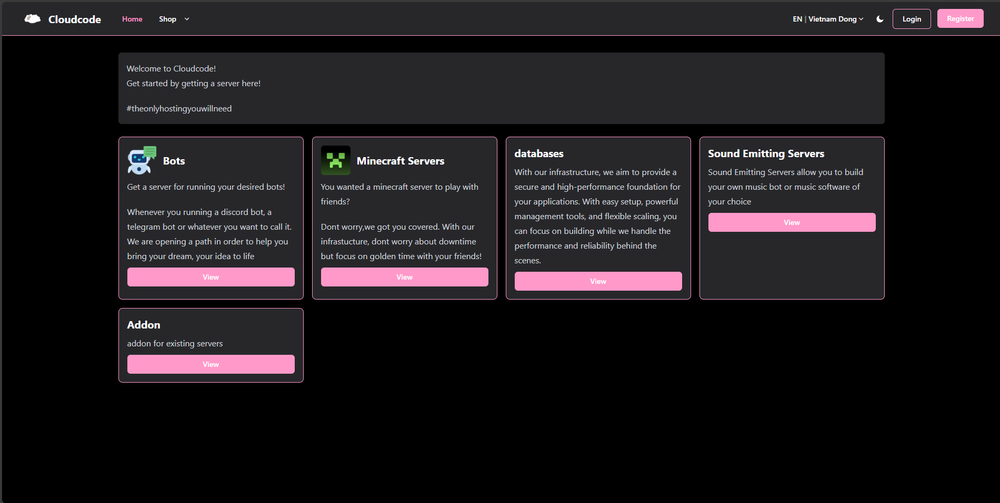
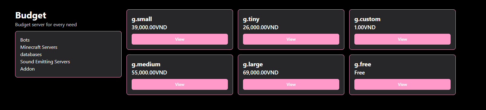
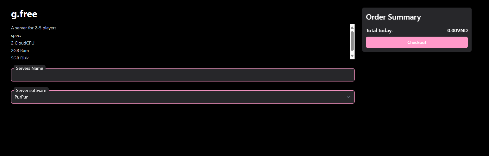
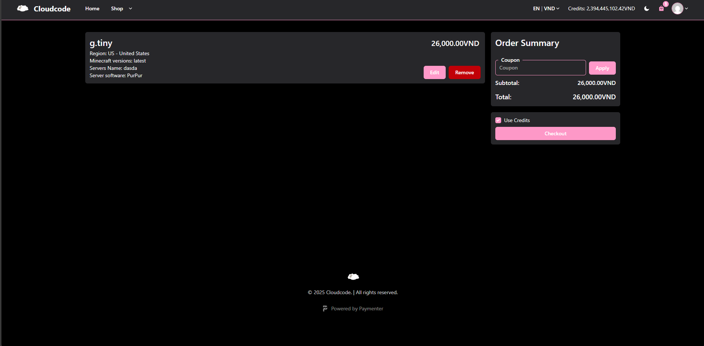

There are 2 type of servers, free and paid.

The free one are limited and get more occasionally.

On the other hand, paid server are alway available, ready to buy and ready to use.

Currently there are 4 type of paid server which could be obtained :

- Minecraft
- Bot Hosting
- Databases
- Voice Server

And 3 type of free server which could be obtained:

- Minecraft
- Bot Hosting
- Databases

Theres also addons where you can get more spec for your current server (Paid)

Usually paid server give out better performance, better region choice and an low downtime as we mentioned in our [sevice level agreement](https://cloudcode.site/sla)

Now to get started, pick out a category that you need and select a plan. Here is an example of minecraft plans:

After selecting one, add it to the cart. This is where you will config your server names and other configuration:

<em> Adding a server to cart </em>

<em> Configure server properties </em>

Now press checkout (and pay if required) to get a server!

> Please note that after ordering a server for the first time, you must open your mailbox and finalize on creating your account on the control panel. 
> The mail could take up to 10 minutes to deliver depend on the mail server