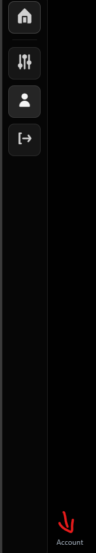
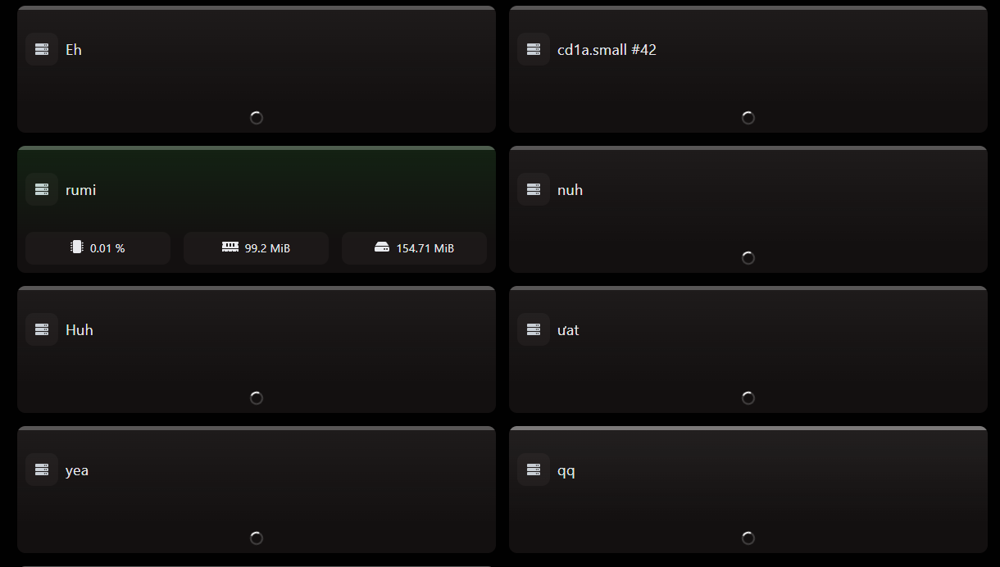
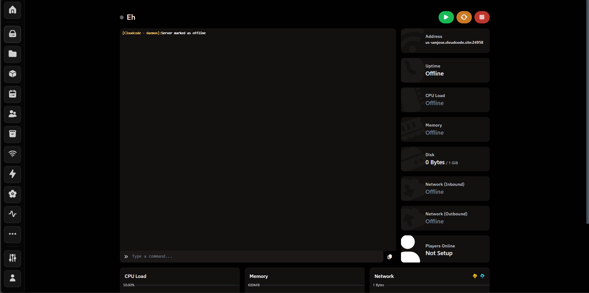
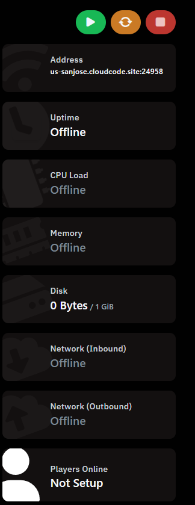
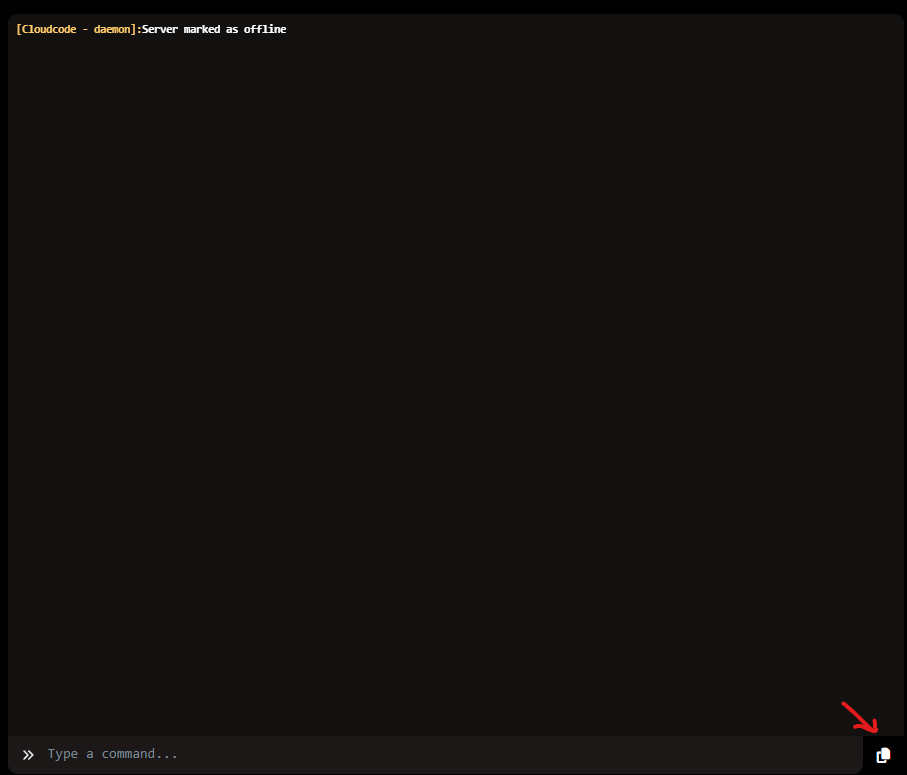
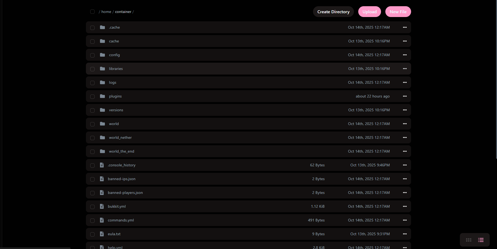
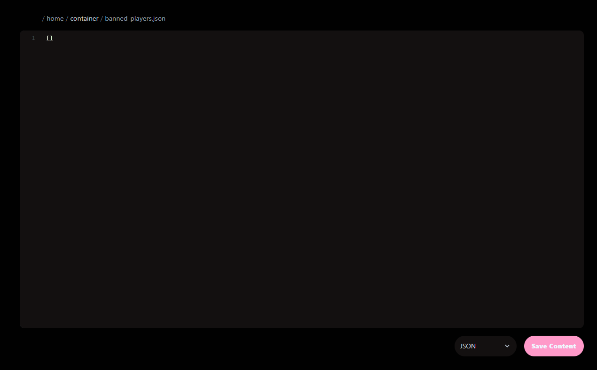
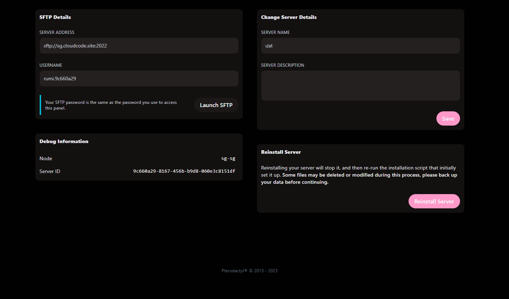

After finalizing your panel account setup, access the panel: [here](https://panel.cloudcode.site), and you will greet with this ui:
## The Dashboard

On your left, its your navigation bar. Hover on one of the icon and a small tooltip will pop up and tell you where to go

Now look at these:

This is how your server will appear on the management dashboard, click on one and it will lead you to the console
## Server Manangement page

### The Console

#### Power Management & Stats

On your right side, there your power management and server stats

#### Console logs and commands

Now on your left side, there your Console which include recent event (logs) and a bar to run command.
also a small button to copy the log and send to us when you need help.

### The File manager
Next part, the file manager.

This is where you can edit your config and files

#### Editing an file

This gonna be the notepad on web you stuck with while we trying to improve it

#### The Settings

This is where you can retrive your sftp creditentials, change the server name or even reinstall it

### What about the rest?
Dont make your mind complicated, you will find it out someday. we're here to introduce you to the basics

